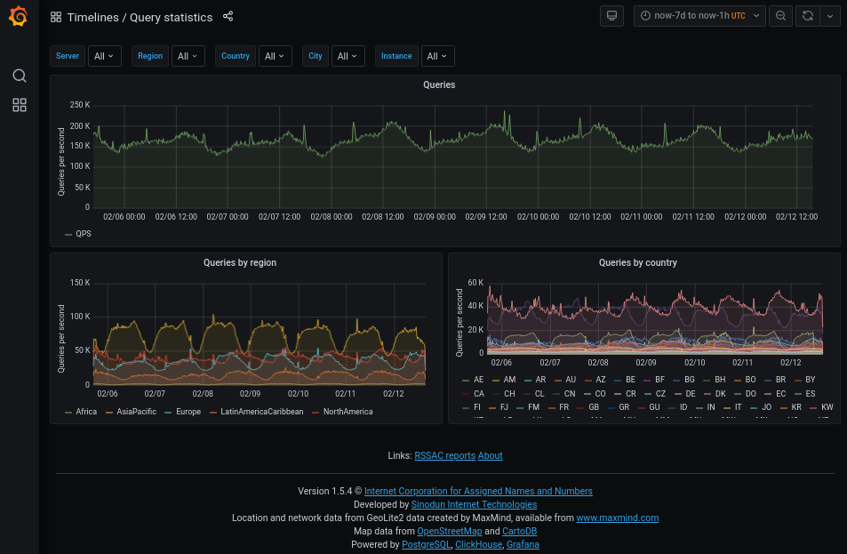
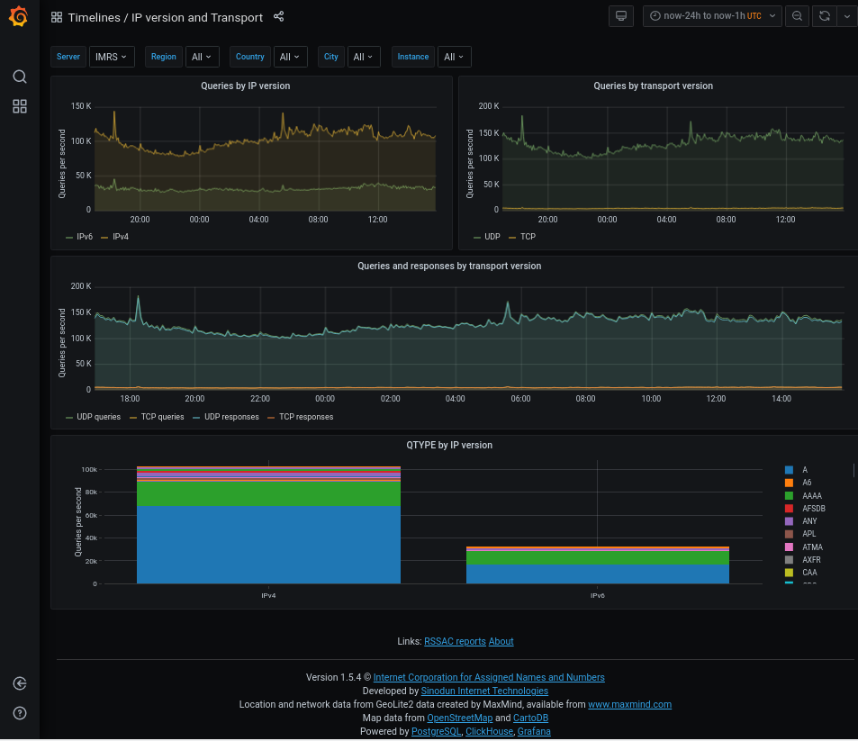
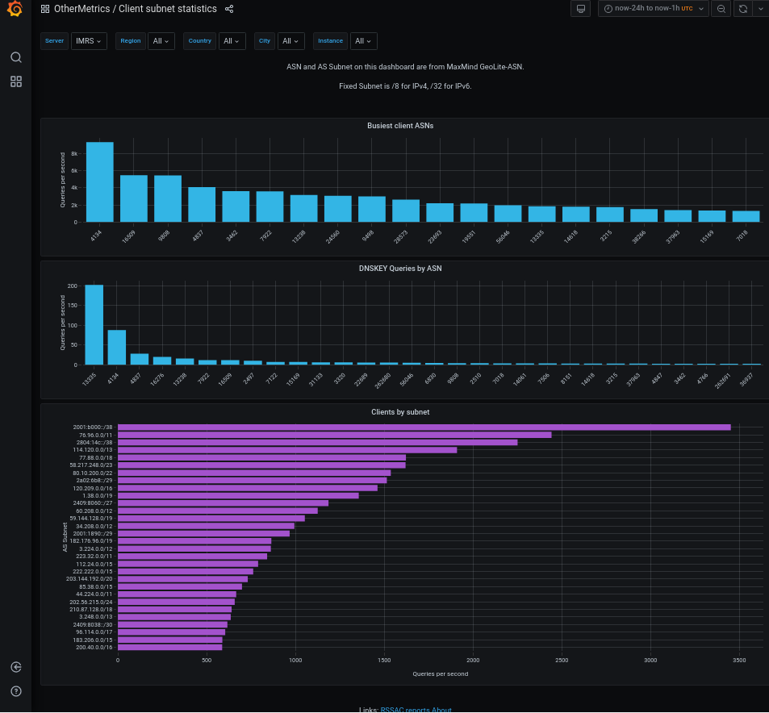

= DNS-STATS Visualizer

== About

DNS-STATS Visualizer is a system which can:

* Consume DNS traffic data files recorded in Compacted-DNS (C-DNS, https://tools.ietf.org/html/rfc8618[RFC8618])
  format from nameservers. (Files in C-DNS format can be generated by
  https://github.com/dns-stats/compactor/wiki[DNS-STATS compactor].)

* Populate a ClickHouse database with per query/response level data
  (and additionally aggregate data at a chosen time interval)

* Produce https://www.dns-oarc.net/tools/dsc[DSC]-like statistics graphs
  of the recorded traffic in Grafana.

RSSAC reports can also be made available via the link at the foot of the main dashboard.

The project was initially developed for https://www.dns.icann.org/imrs/[ICANN]
by http://sinodun.com/[Sinodun IT], and is now released via
http://dns-stats.org[DNS-STATS] as an open source project licensed
under the Mozilla Public License v2.0.

For more information see the
https://github.com/dns-stats/visualizer/wiki[DNS-STATS Visualizer wiki] or
https://github.com/dns-stats/visualizer[github repository].

== Packages

The latest Visualizer packages are available from
https://launchpad.net/~dns-stats/+archive/ubuntu/visualizer[ppa:dns-stats/visualizer].

== Support

- Mailing list: https://mm.dns-stats.org/mailman/listinfo/dns-stats-users
- Issue tracker: https://github.com/dns-stats/visualizer/issues

== Screenshots

A customised version of this framework is used by ICANN for their
https://stats.dns.icann.org[public DNS statistics].
These screenshots are from the ICANN site.

image::doc/images/location_city.png[DNS-STATS Visualizer GeoLocation]

