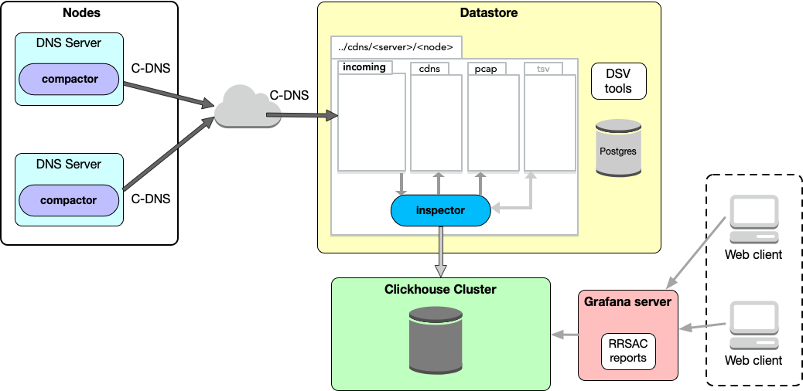
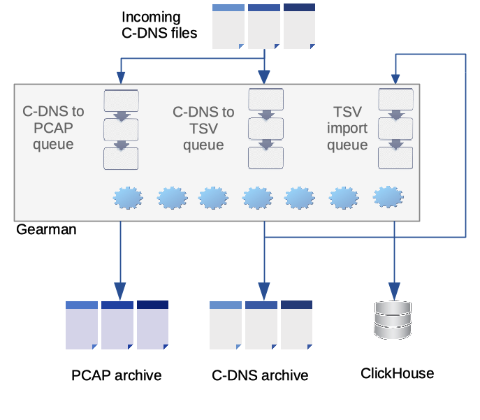

== Overview

This document provides an overview of the DNS-STATS Visualizer system and
instructions for a basic, default install that users can perform to familiarize
themselves with the system and do basic testing. A separate document, the Advanced User Guide
provides more in-depth information on day to day operation of Visualizer,
details on advanced configuration options and how to customise the installation.

=== About

A DNS-STATS Visualizer is a system which can

* consume DNS traffic data files recorded in Compacted-DNS (C-DNS) format from nameservers (such as those generated by
https://github.com/dns-stats/compactor/wiki[DNS-STATS Compactor].)
* populate a https://clickhouse.tech[ClickHouse database] with per query/response level data (and additionally aggregate data at a chosen time interval)
* produce DSC-like statistics graphs of the recorded traffic in Grafana.

As a result, users can either perform ad-hoc queries directly against the
database or customize Grafana to create graphs specific to their needs.
By default, the Grafana graphs are based on data aggregated to 5 minute intervals
so that the resulting graphs are performant for high traffic installations.

.Visualizer system overview

While the Visualizer project can be used to install a complete system with a basic set
of graphs and charts, the intention is that the project serves to provide a framework
which users can adapt to their own particular requirements. For example:

* Add (and remove) data aggregations and Grafana dashboards to tailor displays to
  the requirements of a particular organisation.
* Use the raw query/response data in the database for ad-hoc analysis, and omit
  Grafana and related data aggregations altogether.
* Depending on the volume of data being handled and user requirements, you may choose
  a different aggregation interval or to dispense with aggregations altogether and
  have Grafana deal directly with raw data.

The project was initially developed for for
https://www.dns.icann.org/imrs/[ICANN] by https://www.sinodun.com[Sinodun IT],
and is now released via DNS-STATS as an open source project licenced
under the https://mozilla.org/MPL/2.0[Mozilla Public License v2.0].

Visualizer is currently tested on Ubuntu 18.04 Bionic Beaver only.
Install packages are available from Launchpad:
https://launchpad.net/~dns-stats/+archive/ubuntu/visualizer[ppa:dns-stats/visualizer]

For more information about DNS-STATS and Visualizer see the
http://dns-stats.org/[DNS-STATS website].

Also see the
https://indico.dns-oarc.net/event/34/contributions/788/[presentation at OARC
33] on the use of a customised version of this system by ICANN IMRS.

=== System outline

Visualizer is designed as a multi-host system.
Hosts in a Visualizer system fill one of the following basic roles:

* Datastore server. The hosts to which nameservers send their C-DNS files are
  known as _datastores_. They are responsible for importing the C-DNS data
  into the main ClickHouse table (via an intermediate tab-separated values (TSV) file).
  C-DNS files are archived after import.
** C-DNS can also, optionally, be converted to PCAP files.
* ClickHouse server. A host or a cluster of hosts running a ClickHouse server.
* Grafana server. A host running a Grafana instance providing Visualizer displays
  (_dashboards_).

Depending on the volume of traffic received, processing can also be split between
multiple datastores and across a ClickHouse cluster. Our example install is for
3 separate hosts, with pointers to additional configuration options.

==== File structure on the Datastore

Nameservers sending files in C-DNS format are known as `nodes` in Visualizer,
and their files are grouped logically on disk in
subdirectories under `<default_path>/<Server>/<Node>`. Under each node directory
are these subdirectories:

* `incoming`. C-DNS files received from the node and awaiting processing. Visualizer
  does not specify how files are received from nodes and placed in `incoming` or
  provide any mechanism to do this.
* `cbor`. C-DNS files that have been processed.
* `pcap`. PCAP files that can be optionally re-generated from C-DNS files.
* `error-<queue name>`. Files stored for re-processing where processing has failed.

==== Queue processing

Each datastore runs an instance of the http://gearman.org/[GearMan] server.
GearMan is a simple and lightweight queue manager.

The following queues are maintained by Gearman:

* `cdns-to-tsv`. Convert C-DNS file to TSV.
* `cdns-to-pcap`. Convert C-DNS file to PCAP.
* `import-tsv`. Import the TSV file data into the ClickHouse database and then delete the TSV file.

.Visualizer queue overview

More details on file and queue handling in xref:Advanced_User_Guide.adoc#_gearman_queues[Gearman Queues].

=== ClickHouse schema

The ClickHouse schema is separated into two main sets of tables

* *Raw tables*  held in the `dsv` database. The largest raw table is `QueryResponse`
   which holds a record for each individual query/response logged.
   Some additional tables and underlying aggregation data is also stored here.
* *Aggregated data tables* held in the `dsv_five_minute` database.
   Data here is aggregated on import at 5 minute intervals (by default).
   This data is used for the Grafana plots to ensure they are performant enough,
   although it is possible to create plots using the raw data.

=== Pre-requisites

Visualizer relies on the following components:

.Visualizer pre-requisite components
[cols="1a,4a"]
|===
| https://github.com/dns-stats/compactor/wiki[DNS-STATS Inspector]
| Convert C-DNS files into tab-separated value (TSV) files suitable for import into ClickHouse.

| https://clickhouse.tech[ClickHouse]
| ClickHouse is a fast, open source, online analytical processing (OLAP) database.
  It is column-oriented, scalable, and allows SQL querying of large volumes of data
  in real time.

| https://grafana.com[Grafana]
| Grafana is an open source analytics platform, allowing you to query, visualize,
  alert on and understand metrics.

| https://www.postgresql.org[PostgreSQL]
| Visualizer uses a small PostgreSQL installation in which to keep configuration
  data that is subject to change over time, such as details of the nodes, classification
  of top level domains, etc. Both the volume of data and the volume of reads and writes
  is negligible.

Typically a datastore runs the PostgreSQL server; installations with more than one
  datastore may consider installing PostgreSQL on each datastore, configuring one as a
  replication master and the rest as replication slaves.

| http://gearman.org[Gearman]
| GearMan is an open source framework for farming out work to other machines or processes.
  It is used in Visualizer to manage queues of C-DNS files for conversion and for
  queueing data for import to ClickHouse.

|  https://dev.maxmind.com/geoip/geoip2/geolite2[MaxMind GeoLite2 geolocation data]
| When converting C-DNS for input to ClickHouse, Visualizer uses GeoLite2 data
  to add a client location ID to each query/response record. Visualizer also provides
  a table of location ID and latitude/longitude for use with geographic plots.
  *NOTE:*
  _You will need to obtain a free license for GeoLite,
   as described at https://dev.maxmind.com/geoip/geoip2/geolite2/, and then
   enter the license key details during installation._

| https://github.com/weaveworks/grafanalib[Grafanalib]
| Grafana dashboards are designed interactively and saved as JSON files.
  Grafanalib allows JSON to be produced using Python scripts. Common items
  across dashboards can be generated in shared code, and the source Python
  scripts versioned and managed.

| https://github.com/Sinodun/grafana-plotly-panel[Grafana Plotly plugin]
| A modified version of the standard Grafana Plotly plugin, this Grafana
 plugin adds Plotly bar charts to the available plots and enables different
 plot traces to be built from query data.

| https://github.com/Sinodun/clickhouse-driver[Python ClickHouse client]
| A modified version of the Python ClickHouse driver, changed to be pure Python
 for ease of distribution.
|===

Visualizer commands are implemented in Python, and require Python 3.6 or later.
There are also some scripts requiring `bash`.

=== Optional modules

Visualizer also includes some optional modules:

* Generate RSSAC reports, as outlined in
  https://www.icann.org/groups/rssac/documents[ICANN document]
  RSSAC002. This includes obtaining and reporting the `load-time` metric but not
  the `zone-size` metric.
* Mirror incoming files on a datastore to another host.
